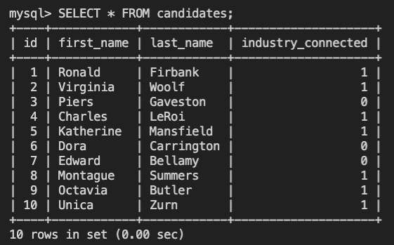

# U-Develop-It
Module 12 | Project 10 | U Vote It

## Description
Application that stores structured data in a relational database and exposes data with an API. The back end will consist of a relational database behind an API. 

## Scenario
U Develop It is starting a new fiscal year, and it's time to pick a new president. Of course, the group is developing its own app for voting. Some members have already started building the front end of the application, but they need volunteers to build the back end.

## Table of Contents
* [Instructions](#Instructions)
* [Tools](#tools)
* [Mock Up](#Mock-Up)

### Instructions
1. Run tests using command line: 'npm run test'
2. After installing the required packages, use the command line to navigate to the root of the application and run `node app`.  Follow prompts to enter player name and play the RPG. 

### Tools

## Mock Up
The following image shows the web application's appearance:
